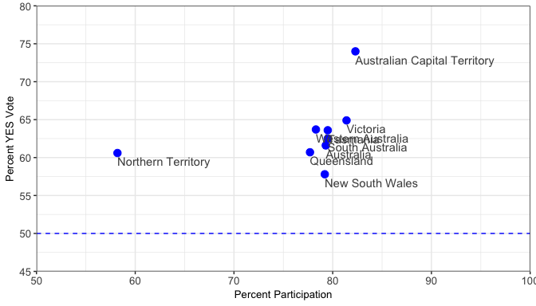
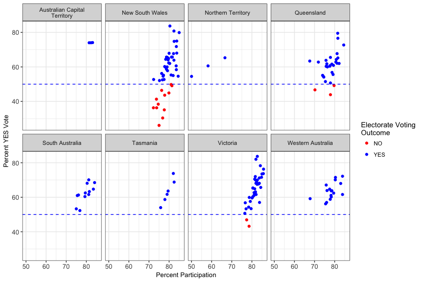

Three Plots
-----------

### My Take on the Results of the Australian Marriage Law Postal Survey in 3 Static Plots

There have been a lot of great, useful interactive data summaries and visualizations published on the Australian Marriage Law Postal Survey results (e.g. the [Australia Bureau of Statistics results summary](https://marriagesurvey.abs.gov.au/results/), [The Guardian's interactive full results by electorate](https://www.theguardian.com/australia-news/datablog/ng-interactive/2017/nov/15/same-sex-marriage-survey-how-australia-voted-electorate-by-electorate), the [ABC News results](http://www.abc.net.au/news/2017-11-15/same-sex-marriage-results-ssm/9145636)).

I love seeing the chloropleth maps of Australia with the overall results, and I love sifting through results interactively electorate-by-electorate—a great presentation approach for users seeking information on a few key places.

However, I find it hard to really see or ask questions about patterns without being about to compare electorates visually *all* in the same space—in one plot or one one page. So I set out to explore the data and create a small set of static data visualizations to explore the state and electorate results more closely, with a focus on being able to compare and contrast quickly.

This is a static data vizualization challenge to myself, and an interesting data set to continue my learning and practice with the [tidyverse](https://www.tidyverse.org/) 😄.

 

#### Plot 1: State Results

 

#### Plot 2: Electorate Results

 

#### Plot 3: This one is in progress....

I am still cleaning the raw data 👩‍💻.

 

Data sourced from the [Australia Bureau of Statistics](https://marriagesurvey.abs.gov.au/results/downloads.html), released under the [CC BY 2.5 AU Licence](https://creativecommons.org/licenses/by/2.5/au/).
